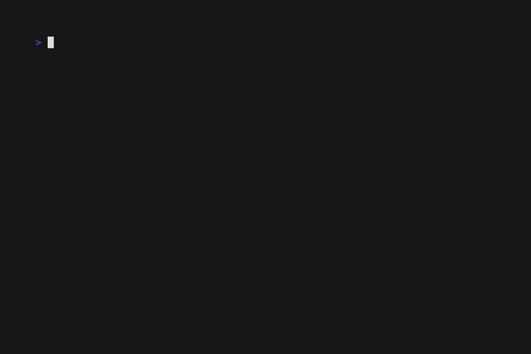

# ♠️♥️ Vim Theme Roulette ♣️♦️

### Roll away for a new theme, lootbox style!  



# Usage
> [!WARNING]  
> Nvim is not supported yet.  

## From source
- Clone repo
- cd into cloned repo
- run ```go run .```
- Follow instructions

# TODO
- Nvim support
- Wrap around bug
- Query user before setting theme
- Account for small amount of themes/favorites
